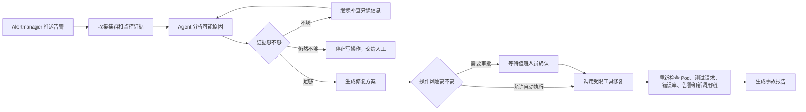
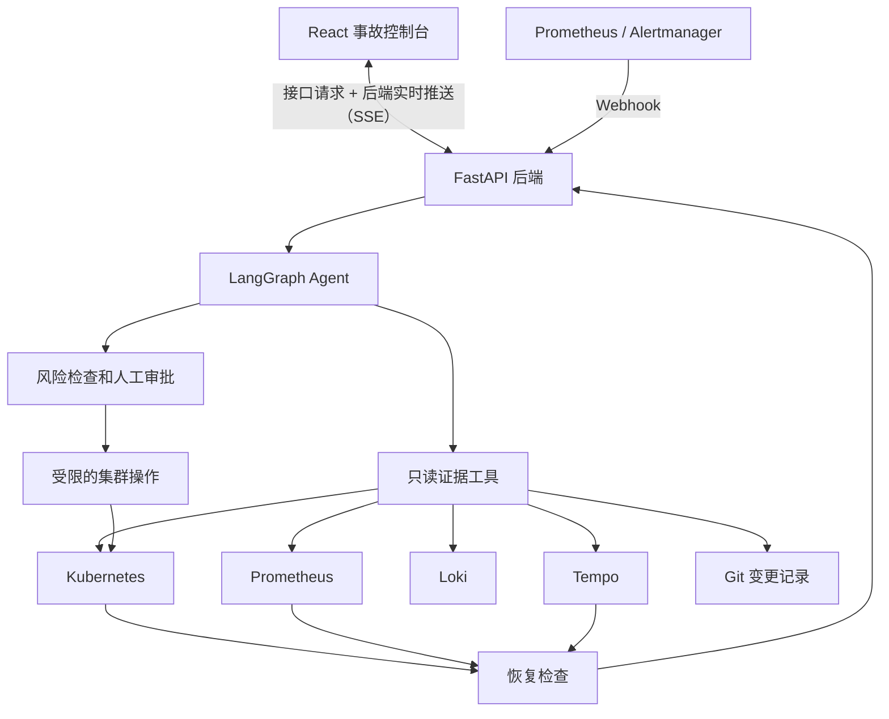

# SentinelOps

一个能处理 Kubernetes 微服务告警的 AI 事故响应 Agent。

[](https://github.com/q741242673/sentinelops/actions/workflows/ci.yml)

收到告警后，SentinelOps 不会马上让模型猜答案。它先去查 Kubernetes、监控指标、日志、调用链和代码变更，再根据查到的内容决定下一步：自动修复、等待人工批准，或者因为证据不足而停止操作。

> 当前版本已经在本地 kind 集群中跑通告警、调查、审批、修复和验证，适合演示和继续开发。接入公司的生产集群前，还需要补上数据持久化、多副本运行、Webhook 鉴权和企业权限管理等能力。

## 它解决什么问题

微服务报警后，值班人员通常要在多个系统之间来回切换：

- 去 Kubernetes 看 Pod 是否健康、最近有没有发布；
- 去 Prometheus 看错误率和请求量；
- 去 Loki 搜错误日志；
- 去 Tempo 找出错的调用链；
- 去 Git 核对最近改了什么；
- 最后再决定是重启、回滚，还是继续排查。

SentinelOps 把这套过程连在一起。大模型负责分析，但不能直接控制集群；能不能修改集群、要不要人工审批、修复后算不算恢复，最后都由后端程序判断。

## 一次告警是怎么处理的



简单说，就是下面 7 步：

1. Alertmanager 把告警推给 SentinelOps。
2. SentinelOps 查询 Kubernetes、Prometheus、Loki、Tempo 和 Git。
3. 后端给每次成功查询生成证据编号，Agent 分析根因时必须引用这些编号。
4. 如果证据不够，只继续查询，不修改集群；达到设定的补查次数后仍不够，就停止并交给人工。
5. 如果证据足够，Agent 只能从提前允许的修复工具里选择动作。
6. 回滚、扩容等高风险操作必须由人批准；低风险操作是否自动执行由服务端策略决定。
7. 执行后重新检查 Pod、测试请求、错误率、告警和新调用链。只有这些检查都通过，事故才会被标记为已恢复。

## 整体结构



项目分成四块：

- **前端控制台**：用 React 和 TypeScript 编写，实时显示 Agent 正在做什么、查了哪些证据、为什么暂停、最终是否恢复。
- **后端服务**：用 FastAPI 接收告警、管理事故状态、处理审批，并通过 SSE（后端主动推送）把新进度立即发给网页。
- **Agent 核心**：用 LangGraph 安排调查和修复步骤。当前后端进程可以暂停等待审批，批准后接着执行；后端一旦重启，内存中的进度会丢失，所以接入生产环境前还要增加数据库。
- **集群与监控环境**：本地使用 kind 运行微服务、Prometheus、Alertmanager、Loki、Tempo 和 OpenTelemetry Collector。

## 前端演示

项目自带一个本地前端。启动完整本地环境后，可以直接运行三种 Demo，查看告警发生后 Agent 查了什么、做了什么，以及最后有没有恢复：

| 场景 | 会发生什么 | 预期结果 |
|---|---|---|
| 人工审批 | 发布一个会让库存请求间歇性失败的新版本 | Agent 找到故障版本并提出回滚，停在审批页面等待人工确认 |
| 自动修复 | 在库存服务进程中打开一个重启即可清除的故障 | Agent 确认证据后自动滚动重启，并检查服务是否恢复 |
| 复杂调查 | 制造一个需要继续查日志、指标和代码变更的故障 | Agent 会继续补查；证据足够就给出方案，仍有冲突就停止写操作并交给人工 |

网页不是写死的动画。它通过 SSE 接收后端进度，会显示：

- 当前执行到哪个步骤；
- 调用了哪个查询工具；
- 找到了哪些证据；
- Agent 给出的根因和置信度；
- 是否进行了补查；
- 为什么需要人工审批；
- 实际执行了什么集群操作；
- 用什么结果证明服务已经恢复。

## 大模型能做什么，不能做什么

SentinelOps 给大模型加了几条硬限制：

1. **没有证据就不能下结论**：模型引用的证据必须对应后端实际执行成功的查询；编号不存在、查询失败或来源不一致都会被拒绝。
2. **证据不足就不写集群**：达到设定的补查次数后仍不确定，就交给人工处理。
3. **模型不能随便调用命令**：系统没有把 Shell 交给模型，只开放少量提前定义好的工具。
4. **模型不能给自己提权**：审批规则由服务端控制，告警标签和模型回答都不能改变权限。
5. **高风险操作必须有人确认**：回滚和扩容默认停在人工审批门。
6. **模型不能宣布自己修好了**：恢复结果由 Pod 状态、测试请求、错误率、告警和新调用链一起判断。
7. **模型不能修改无关服务**：重启、回滚和扩缩容默认只能作用于当前告警对应的服务，参数不合法时会在调用 Kubernetes 前被拒绝；回滚目标还必须带有服务端认可的明确健康标记。

## 快速运行：不需要 Kubernetes 和模型 Key

适合先确认项目能跑起来。

第一次使用先下载仓库：

```bash
git clone https://github.com/q741242673/sentinelops.git
cd sentinelops
```

命令行演示只需要 Python 3.11+：

```bash
python3 -m venv .venv
source .venv/bin/activate
python -m pip install -e ".[dev]"
sentinelops demo --scenario bad_rollout --approve
```

这条命令使用本地模拟数据，不会连接 Kubernetes，也不会调用收费模型。流程仍会先停在审批节点；`--approve` 会模拟值班人员点击同意，然后继续执行模拟回滚并输出事故报告。

启动本地网页：

```bash
make console
```

网页还需要 Node.js 22+。第一次运行时，脚本会自动安装 `web` 目录的前端依赖。不带额外配置时，后端使用模拟工具和固定规则，不会连接 Kubernetes 或收费模型。

打开 <http://127.0.0.1:5173>。

## 完整运行：kind + 监控系统 + 大模型

要求：

- Python 3.11+
- Node.js 22+
- Docker
- kind
- kubectl
- 一个兼容 OpenAI 请求格式的模型服务，以及它的地址、模型名称和 API Key

启动：

```bash
SENTINELOPS_MODEL_PROVIDER=openai_compatible \
SENTINELOPS_MODEL_NAME=your-model-name \
SENTINELOPS_MODEL_BASE_URL=https://api.example.com/v1 \
SENTINELOPS_MODEL_API_KEY=replace-me \
make console-live
```

脚本会自动完成这些事情：

1. 创建或复用本地 kind 集群；
2. 部署订单服务和库存服务；
3. 部署 Prometheus、Alertmanager、Loki、Tempo 和 OpenTelemetry Collector；
4. 启动持续测试流量；
5. 启动 FastAPI 后端和 React 前端。

打开 <http://127.0.0.1:5173>，选择一个场景开始即可。

停止网页后，默认保留 kind 集群，方便下次快速启动。彻底删除环境：

```bash
make console-live-down
```

## 更换模型

Agent 不绑定某一家模型供应商。模型服务的请求格式需要兼容 OpenAI 的 `/chat/completions` 接口，并能按照要求返回 JSON；DeepSeek、OpenAI、vLLM 或其他满足这个条件的服务都可以接入。

如果单独运行后端，可以把模型配置保存到 `.env`：

```bash
cp .env.example .env
```

填写：

```dotenv
SENTINELOPS_MODEL_PROVIDER=openai_compatible
SENTINELOPS_MODEL_NAME=your-model-name
SENTINELOPS_MODEL_BASE_URL=https://api.example.com/v1
SENTINELOPS_MODEL_API_KEY=replace-me
```

运行 `make console-live` 时，请像上一节那样在命令前传入这四个变量；这样无论换哪一家服务，启动脚本都不会猜测你想用哪个模型。

`rule_based` 是给本地离线测试和 CI 使用的固定规则实现，不应该当作生产环境里的大模型。

## 连接已有 Kubernetes 集群

本地运行时读取当前 kubeconfig；部署到 Pod 中时使用 ServiceAccount。

```dotenv
SENTINELOPS_TOOL_BACKEND=kubernetes
SENTINELOPS_KUBERNETES_NAMESPACE=sentinelops-demo
```

示例 RBAC：

```bash
kubectl apply -f deploy/rbac.yaml
```

请在接入生产集群前检查并缩小权限范围。当前工具支持读取 Pod、事件、日志和发布历史，以及滚动重启、回滚和扩缩容。模型本身拿不到任意 Shell、Secret 或特权 Pod 权限。

如果希望 Agent 自动提出回滚，发布流水线需要先完成就绪检查，再给这一次发布对应的 ReplicaSet 写入健康证明：

```bash
python3 scripts/attest_revision_health.py \
  --namespace sentinelops-demo \
  --deployment order-service \
  --verifier production-release-pipeline
```

证明会绑定 Deployment UID、ReplicaSet UID、revision、Pod 模板哈希、镜像引用、实际运行的镜像 ID、Git commit 和验证时间。它只写在这个 ReplicaSet 自己的 metadata 上，不会跟着 Deployment 模板传播到未来版本。证明缺失、被复制、字段不完整或与当前 revision 不一致时都会被当成未知状态，Agent 不会自动回滚到它。

生产环境建议使用不可变镜像 digest，并让独立的发布验证身份拥有写证明权限；Agent 自己只读这些证明。示例 RBAC 仍然没有给 Agent 修改 ReplicaSet 的权限。这里的可信边界是 Kubernetes 的 RBAC 和审计日志，并不是独立的数字签名；如果多个不可信主体都能修改 ReplicaSet annotation，应再接外部签名或准入控制，不能只依赖这组注解。

## 配置监控和代码变更证据

```dotenv
SENTINELOPS_PROMETHEUS_URL=http://127.0.0.1:9090
SENTINELOPS_LOKI_URL=http://127.0.0.1:3100
SENTINELOPS_TEMPO_URL=http://127.0.0.1:3200
SENTINELOPS_CHANGE_REPOSITORY_PATH=/absolute/path/to/sentinelops
SENTINELOPS_DIAGNOSIS_CONFIDENCE_THRESHOLD=0.8
SENTINELOPS_MAX_REFLECTION_ROUNDS=1
```

`SENTINELOPS_MAX_REFLECTION_ROUNDS` 控制最多补查几轮，默认是 1，可设置为 0～3。所有查询都有数量和时间范围限制。模型只能选择“还想查哪一类证据”，不能自己提交 Shell、文件路径、PromQL 或 LogQL 让系统直接执行。

演示环境会把 Git commit 写进 Kubernetes Deployment 的注解。后端读取当前版本和上一个版本的注解，再到配置好的仓库中核对这次提交改了什么，因此不会只凭告警文字猜测代码变更。

## 单独运行后端

```bash
sentinelops serve
```

- API：<http://127.0.0.1:8000>
- API 文档：<http://127.0.0.1:8000/docs>
- Alertmanager Webhook：`POST http://127.0.0.1:8000/api/v1/webhooks/alertmanager`

直接运行这条命令时，默认使用模拟工具和 `rule_based` 固定规则，方便离线检查。要连接 Kubernetes、监控系统和大模型，请使用上面的环境变量，或直接运行 `make console-live`。

创建事故：

```bash
curl -sS http://127.0.0.1:8000/api/v1/incidents \
  -H 'content-type: application/json' \
  -d '{
    "name": "HighOrderServiceErrorRate",
    "namespace": "sentinelops-demo",
    "service": "order-service",
    "severity": "critical",
    "summary": "订单服务错误率超过阈值"
  }'
```

批准修复：

```bash
curl -sS http://127.0.0.1:8000/api/v1/incidents/INCIDENT_ID/approval \
  -H 'content-type: application/json' \
  -d '{"approved": true, "note": "值班人员确认回滚"}'
```

## 测试和验收

日常检查：

```bash
make test
make lint
npm run build --prefix web
```

kind 故障测试：

```bash
make kind-e2e
```

Prometheus、Loki、Tempo 连通性测试：

```bash
make observability-e2e
```

完整的“告警 → 人工审批 → 回滚 → 恢复验证”测试：

```bash
make golden-path-e2e
```

GitHub Actions 会运行后端测试、前端构建、离线评估、kind 端到端测试和监控系统连通性测试。测试数量会随功能变化，以 [GitHub Actions](https://github.com/q741242673/sentinelops/actions) 的最新结果为准。

## 项目目录

```text
src/sentinelops/
├── agent/          # Agent 执行流程、质量检查和风险策略
├── llm/            # 大模型接口和不同服务的适配代码
├── tools/          # Kubernetes、监控和 Git 查询工具
├── api.py          # FastAPI 接口、告警接收和实时进度
├── demo.py         # 本地演示的故障注入与环境恢复
├── lab_profiles.py # 三种演示流程的服务端绑定规则
└── runtime.py      # 生产 Agent 的组装入口
web/                # React + TypeScript 事故控制台
demo/               # 本地微服务和测试流量
deploy/             # Kubernetes、RBAC 和监控配置
evals/              # 可重复运行的 Agent 评估
tests/              # 单元测试和安全边界测试
```

## 当前完成度

已经完成：

- 可替换的大模型接口；
- 告警到调查、审批、执行、验证和报告的完整流程；
- Kubernetes、Prometheus、Loki、Tempo 和 Git 证据采集；
- 人工审批、自动修复和复杂调查三种本地演示；
- React 实时事故控制台；
- kind、监控系统和 GitHub Actions 端到端测试；

接入生产环境前还需要：

- 用 PostgreSQL 等数据库保存事故和执行记录；
- 支持后端多副本和任务接管；
- 给 Alertmanager Webhook 增加身份认证和签名校验；
- 接入企业 Secret 管理和更细的 RBAC；
- 增加不可篡改的审计记录、限流和灾难恢复方案。

现在它已经能在本地 Kubernetes 和监控环境中完成一整次事故处理，但还不适合未经评估就直接接管生产集群。

## 开源协议

Apache-2.0
