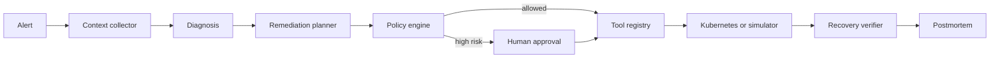

# SentinelOps

Model-agnostic Kubernetes incident diagnosis and remediation agent with evidence-based
reasoning, human approval, allowlisted tools, resumable execution, and automated evaluation.

SentinelOps is intentionally more than a chat UI. Given an alert, it collects bounded
Kubernetes context, produces a diagnosis tied to evidence, proposes a reversible action,
pauses for approval when risk exceeds policy, executes through a constrained tool registry,
and verifies recovery before generating a postmortem.

> Status: runnable v0.1 foundation. The offline simulator and evaluation suite work without a
> Kubernetes cluster or model API key. The real Kubernetes and OpenAI-compatible adapters are
> included for integration work.

## Why this repository exists

Many agent demos stop at a plausible answer. Incident response needs stronger guarantees:

- conclusions must point to evidence;
- model output cannot bypass tool allowlists;
- mutating actions need risk classification and approval;
- an interrupted process must resume rather than restart its reasoning;
- remediation is not successful until recovery criteria pass;
- behavior should be measured on repeatable fault scenarios.

## Architecture



The graph uses LangGraph checkpoints and interrupts. Models implement one internal provider
contract; tools implement one backend contract. Neither the agent nodes nor policy engine know
which model vendor or cluster backend is active.

## Quick start

Requirements: Python 3.11+.

```bash
python3 -m venv .venv
source .venv/bin/activate
python -m pip install -e ".[dev]"
sentinelops demo --scenario bad_rollout --approve
```

The command prints the record before approval, resumes the same graph thread, performs a
simulated rollback, verifies the new health snapshot, and prints the final postmortem.

Other deterministic scenario:

```bash
sentinelops demo --scenario db_pool_exhaustion --approve
```

Run the API:

```bash
sentinelops serve
```

Create an incident:

```bash
curl -sS http://127.0.0.1:8000/api/v1/incidents \
  -H 'content-type: application/json' \
  -d '{
    "name": "HighOrderServiceErrorRate",
    "namespace": "sentinelops-demo",
    "service": "order-service",
    "severity": "critical",
    "summary": "Order service error rate exceeded the SLO"
  }'
```

Approve the returned incident ID:

```bash
curl -sS http://127.0.0.1:8000/api/v1/incidents/INCIDENT_ID/approval \
  -H 'content-type: application/json' \
  -d '{"approved": true, "note": "Approved by on-call engineer"}'
```

Interactive API docs are available at `http://127.0.0.1:8000/docs`.

## Use a model API

Copy the example configuration and fill in any OpenAI-compatible endpoint:

```bash
cp .env.example .env
```

```dotenv
SENTINELOPS_MODEL_PROVIDER=openai_compatible
SENTINELOPS_MODEL_NAME=your-model-name
SENTINELOPS_MODEL_BASE_URL=https://api.example.com/v1
SENTINELOPS_MODEL_API_KEY=replace-me
```

The provider adapter asks for JSON matching Pydantic-generated schemas. DeepSeek, OpenAI,
vLLM and compatible gateways can be configured without changing graph code. Native provider
adapters can be added by implementing `LLMProvider.structured` and registering the adapter in
`llm/registry.py`.

## Connect a Kubernetes cluster

Set:

```dotenv
SENTINELOPS_TOOL_BACKEND=kubernetes
SENTINELOPS_KUBERNETES_NAMESPACE=sentinelops-demo
```

Locally, the adapter loads the current kubeconfig. In a Pod, it uses the mounted ServiceAccount.
Apply the example namespace-scoped role after reviewing it:

```bash
kubectl apply -f deploy/rbac.yaml
```

The included live adapter supports bounded reads, rolling restart, and scaling. Production
rollback is deliberately not faked with an unsafe patch: connect the repository's deployment
controller (Argo Rollouts, Flux, or another GitOps controller) as a separate tool.

## MCP server

Install the optional extra and start the stdio server:

```bash
python -m pip install -e ".[mcp]"
sentinelops-mcp
```

The MCP server exposes focused Kubernetes tools, while the Agent host remains responsible for
approval and policy. This separation prevents a tool server from silently granting itself
automation authority.

## Safety model

| Risk | Example | Default behavior |
|---|---|---|
| Read-only | logs, pods, events | automatic |
| Low | bounded metadata operation | automatic |
| Medium | restart deployment | approval required |
| High | rollback or scale | approval required |
| Permanently denied | arbitrary exec, secrets, privileged Pod | rejected |

The model never receives a shell tool. Every call goes through an allowlist and required
argument validation. RBAC is the final infrastructure boundary, not a replacement for host-side
policy.

## Evaluation

```bash
python evals/run.py
```

The first suite checks two incidents end-to-end and records:

- root-cause correctness;
- recovery success;
- mutating tool count;
- end-to-end duration.

The next milestone will add fault injection against a disposable `kind` cluster, request-level
SLIs from Prometheus, model cost/latency telemetry, and trace-level graders.

## Repository map

```text
src/sentinelops/
├── agent/          # graph, state, policy, interrupt/resume
├── llm/            # provider-neutral contract and adapters
├── tools/          # allowlist, simulator, Kubernetes API backend
├── api.py          # FastAPI endpoints
├── mcp_server.py   # optional MCP facade
└── runtime.py      # dependency wiring
evals/              # repeatable incident evaluation
deploy/             # namespace-scoped RBAC
tests/              # graph, policy and tool-boundary tests
```

## Roadmap

- [x] Provider-neutral model gateway
- [x] LangGraph diagnosis-to-remediation workflow
- [x] Human approval and checkpoint resume
- [x] Tool allowlist and risk policy
- [x] Offline Kubernetes incident simulator
- [x] Kubernetes API and MCP adapters
- [x] REST API and CI evaluation
- [ ] Disposable `kind` fault lab
- [ ] Prometheus, Loki and Tempo MCP servers
- [ ] PostgreSQL checkpointer and event store
- [ ] OpenTelemetry spans for model and tool calls
- [ ] Web incident command center
- [ ] Multi-model benchmark report

## License

Apache-2.0

