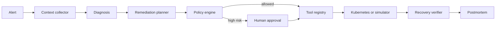
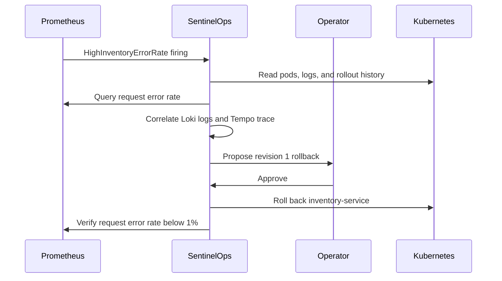

# SentinelOps

Model-agnostic Kubernetes incident diagnosis and remediation agent with evidence-based
reasoning, human approval, allowlisted tools, resumable execution, and automated evaluation.

SentinelOps is intentionally more than a chat UI. Given an alert, it collects bounded
Kubernetes context, produces a diagnosis tied to evidence, proposes a reversible action,
pauses for approval when risk exceeds policy, executes through a constrained tool registry,
and verifies recovery before generating a postmortem.

> Status: runnable v0.1. The local Incident Console and offline simulator work without a
> Kubernetes cluster or model API key. The real kind, Prometheus, Loki, Tempo, and DeepSeek
> golden path is verified in GitHub Actions.

## Why this repository exists

Many agent demos stop at a plausible answer. Incident response needs stronger guarantees:

- conclusions must point to evidence;
- model output cannot bypass tool allowlists;
- mutating actions need risk classification and approval;
- an interrupted process must resume rather than restart its reasoning;
- remediation is not successful until recovery criteria pass;
- behavior should be measured on repeatable fault scenarios.

## Architecture



The graph uses LangGraph checkpoints and interrupts. Models implement one internal provider
contract; tools implement one backend contract. Neither the agent nodes nor policy engine know
which model vendor or cluster backend is active.

## Quick start

Requirements: Python 3.11+.

```bash
python3 -m venv .venv
source .venv/bin/activate
python -m pip install -e ".[dev]"
sentinelops demo --scenario bad_rollout --approve
```

The command prints the record before approval, resumes the same graph thread, performs a
simulated rollback, verifies the new health snapshot, and prints the final postmortem.

### Local Incident Console

The portfolio demo includes a local operations console that visualizes the complete Agent graph,
evidence-backed diagnosis, allowlisted remediation, approval gate, and recovery audit trail.
Node.js 22+ is required in addition to Python.

```bash
make console
```

Open `http://127.0.0.1:5173`. The console creates a deterministic incident on first load, pauses
at the high-risk rollback, and resumes the same LangGraph thread when you approve it. The browser
is local-only; FastAPI remains the Agent control plane so the UI operates real incident state
instead of static mock data.

For a fully live local demo, start Docker and provide an OpenAI-compatible model key, then run:

```bash
SENTINELOPS_MODEL_API_KEY=replace-me make console-live
```

This mode creates a kind cluster, deploys Prometheus, Loki, Tempo, OpenTelemetry Collector and
the demo services, injects a failing inventory revision, and keeps checkout traffic flowing. The
console waits for the real `HighInventoryErrorRate` alert and a queryable failed trace before the
Agent reads Kubernetes rollout history, metrics, logs and spans. The default model endpoint is
DeepSeek `deepseek-chat`; the provider remains replaceable through the existing model variables.
The cluster is retained when the console stops so subsequent starts can reuse the node image.
Remove it with `make console-live-down`.

Other deterministic scenario:

```bash
sentinelops demo --scenario db_pool_exhaustion --approve
```

Run the API:

```bash
sentinelops serve
```

Create an incident:

```bash
curl -sS http://127.0.0.1:8000/api/v1/incidents \
  -H 'content-type: application/json' \
  -d '{
    "name": "HighOrderServiceErrorRate",
    "namespace": "sentinelops-demo",
    "service": "order-service",
    "severity": "critical",
    "summary": "Order service error rate exceeded the SLO"
  }'
```

Approve the returned incident ID:

```bash
curl -sS http://127.0.0.1:8000/api/v1/incidents/INCIDENT_ID/approval \
  -H 'content-type: application/json' \
  -d '{"approved": true, "note": "Approved by on-call engineer"}'
```

Interactive API docs are available at `http://127.0.0.1:8000/docs`.

## Use a model API

Copy the example configuration and fill in any OpenAI-compatible endpoint:

```bash
cp .env.example .env
```

```dotenv
SENTINELOPS_MODEL_PROVIDER=openai_compatible
SENTINELOPS_MODEL_NAME=your-model-name
SENTINELOPS_MODEL_BASE_URL=https://api.example.com/v1
SENTINELOPS_MODEL_API_KEY=replace-me
```

The provider adapter asks for JSON matching Pydantic-generated schemas. DeepSeek, OpenAI,
vLLM and compatible gateways can be configured without changing graph code. Native provider
adapters can be added by implementing `LLMProvider.structured` and registering the adapter in
`llm/registry.py`.

## Connect a Kubernetes cluster

Set:

```dotenv
SENTINELOPS_TOOL_BACKEND=kubernetes
SENTINELOPS_KUBERNETES_NAMESPACE=sentinelops-demo
```

Locally, the adapter loads the current kubeconfig. In a Pod, it uses the mounted ServiceAccount.
Apply the example namespace-scoped role after reviewing it:

```bash
kubectl apply -f deploy/rbac.yaml
```

The live adapter supports bounded reads, rolling restart, scaling, and revision rollback.
Rollback resolves an owned ReplicaSet by `deployment.kubernetes.io/revision`, restores its Pod
template through a resource-version-guarded Deployment update, and then waits for every matching
Pod and the workload availability signal to recover. In GitOps-managed production environments,
replace this adapter with an Argo Rollouts or Flux MCP tool so Git remains the source of truth.

## Real kind fault lab

The repository includes a real Kubernetes end-to-end scenario. It creates a disposable `kind`
cluster, deploys a healthy NGINX-backed `order-service`, injects a broken Deployment revision,
waits until the new Pod reaches `CrashLoopBackOff`, and runs SentinelOps against the Kubernetes
API. After approval, SentinelOps restores revision 1 and verifies the Pods recover.

Requirements: Docker, `kind`, and `kubectl`.

```bash
make kind-e2e
```

To keep the cluster for inspection:

```bash
SENTINELOPS_KEEP_KIND_CLUSTER=true make kind-e2e
kubectl get pods,rs,deploy -n sentinelops-demo
make kind-down
```

The same scenario runs in GitHub Actions on every push and pull request.

## Observability evidence

SentinelOps can enrich Kubernetes evidence with read-only Prometheus, Loki, and Tempo queries.
Configure only the backends that are available:

```dotenv
SENTINELOPS_PROMETHEUS_URL=http://127.0.0.1:9090
SENTINELOPS_LOKI_URL=http://127.0.0.1:3100
SENTINELOPS_TEMPO_URL=http://127.0.0.1:3200
SENTINELOPS_OBSERVABILITY_TIMEOUT_SECONDS=10
```

When configured, live investigations automatically collect a bounded HTTP error-rate query and
recent error logs for the alerted service. A Tempo trace is fetched only when the alert includes
a `trace_id` label. All three tools are read-only and apply hard limits:

| Tool | Boundary |
|---|---|
| `query_prometheus` | instant query, 1,000-character maximum |
| `search_loki` | backward range query, maximum 200 entries |
| `get_trace` | validated 16-64 character hexadecimal trace ID |

The HTTP client uses explicit configured base URLs, a maximum 60-second timeout, and ignores
ambient proxy variables so internal telemetry is not accidentally routed through an external
proxy.

### In-cluster telemetry lab

The repository also ships a reproducible telemetry lab: two instrumented FastAPI services,
Prometheus, Loki, Tempo, and an OpenTelemetry Collector, all running inside a disposable `kind`
cluster. The inventory service fails every third reservation, producing correlated success and
failure metrics, structured OTLP logs, and distributed traces.

Run the complete acceptance test:

```bash
make observability-e2e
```

The test builds one model-neutral demo-service image, generates twelve checkout requests, and
uses SentinelOps' production observability adapters to prove that all three signals are
queryable. It fails unless Prometheus returns request samples, Loki returns checkout logs, and
Tempo returns spans for a trace ID produced by the request.

To keep the lab running for exploration:

```bash
SENTINELOPS_KEEP_OBSERVABILITY_CLUSTER=true make observability-e2e
kubectl get pods -n sentinelops-demo
make observability-down
```

### Live incident golden path

The telemetry lab also exercises the complete incident loop rather than stopping after a
successful query:



Run it with:

```bash
make golden-path-e2e
```

The command starts with a healthy inventory revision, rolls out a configuration that fails every
third reservation, waits for the real Prometheus alert to fire, and supplies its labels plus a
failed trace ID to SentinelOps. The agent collects Kubernetes, Prometheus, Loki, and Tempo
evidence, pauses on its high-risk rollback, resumes after approval, and continuously checks the
10-second request error rate. The test passes only after the alert clears and six fresh checkout
requests all return HTTP 200.

CI uses the deterministic `rule_based` provider so this acceptance test needs no model key. To
exercise the same infrastructure path with DeepSeek or another OpenAI-compatible endpoint, set
the model variables before running the command:

```bash
SENTINELOPS_MODEL_PROVIDER=openai_compatible \
SENTINELOPS_MODEL_NAME=your-model-name \
SENTINELOPS_MODEL_BASE_URL=https://api.example.com/v1 \
SENTINELOPS_MODEL_API_KEY=replace-me \
make golden-path-e2e
```

The `deepseek-e2e` GitHub Actions workflow runs this complete path against the real
`deepseek-chat` API. It is deliberately `workflow_dispatch` only, so pull requests and pushes do
not consume model credits. Configure a repository Actions secret named `DEEPSEEK_API_KEY`, then
start it from the Actions page or with:

```bash
gh workflow run deepseek-e2e.yml
```

The secret is injected only into the final incident-loop step. A successful run proves that the
model used live Kubernetes, Prometheus, Loki, and Tempo evidence to select an allowlisted action,
paused for approval, rolled the deployment back, and verified traffic and alert recovery.

## MCP server

Install the optional extra and start the stdio server:

```bash
python -m pip install -e ".[mcp]"
sentinelops-mcp
```

The MCP server exposes focused Kubernetes and configured observability tools, while the Agent
host remains responsible for approval and policy. This separation prevents a tool server from
silently granting itself automation authority.

## Safety model

| Risk | Example | Default behavior |
|---|---|---|
| Read-only | logs, pods, events | automatic |
| Low | bounded metadata operation | automatic |
| Medium | restart deployment | approval required |
| High | rollback or scale | approval required |
| Permanently denied | arbitrary exec, secrets, privileged Pod | rejected |

The model never receives a shell tool. Every call goes through an allowlist and required
argument validation. RBAC is the final infrastructure boundary, not a replacement for host-side
policy.

## Evaluation

```bash
python evals/run.py
```

The first suite checks two incidents end-to-end and records:

- root-cause correctness;
- recovery success;
- mutating tool count;
- end-to-end duration.

The next evaluation milestone adds request-level SLI fixtures, model cost/latency telemetry, and
trace-level graders.

## Repository map

```text
src/sentinelops/
├── agent/          # graph, state, policy, interrupt/resume
├── llm/            # provider-neutral contract and adapters
├── tools/          # allowlist, simulator, Kubernetes and observability backends
├── api.py          # FastAPI endpoints
├── mcp_server.py   # optional MCP facade
└── runtime.py      # dependency wiring
evals/              # repeatable incident evaluation
deploy/             # namespace-scoped RBAC
tests/              # graph, policy and tool-boundary tests
```

## Roadmap

- [x] Provider-neutral model gateway
- [x] LangGraph diagnosis-to-remediation workflow
- [x] Human approval and checkpoint resume
- [x] Tool allowlist and risk policy
- [x] Offline Kubernetes incident simulator
- [x] Kubernetes API and MCP adapters
- [x] REST API and CI evaluation
- [x] Disposable `kind` fault lab
- [x] Prometheus, Loki and Tempo MCP query adapters
- [x] In-cluster Prometheus, Loki, Tempo and OTel Collector demo stack
- [x] Firing Prometheus alert to approved rollback and request-SLI recovery loop
- [ ] PostgreSQL checkpointer and event store
- [ ] OpenTelemetry spans for model and tool calls
- [ ] Web incident command center
- [ ] Multi-model benchmark report

## License

Apache-2.0
